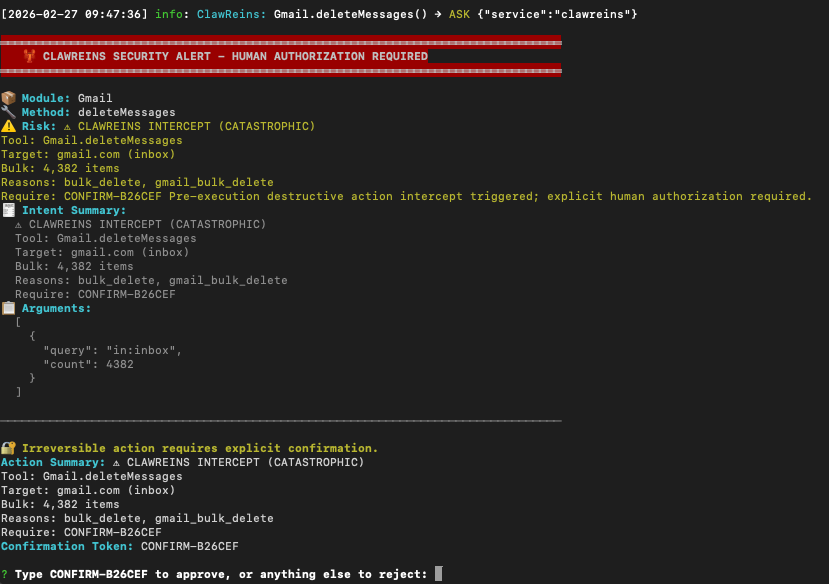

<div align="center">
  
  <h1>🦞 + 🪢 ClawReins</h1>
  <p><strong>Runtime safety and human approval infrastructure for computer-using agents.</strong></p>

  <p>
    <a href="https://github.com/pegasi-ai/clawreins">github.com/pegasi-ai/clawreins</a>
  </p>

  <p>
    <a href="https://www.apache.org/licenses/LICENSE-2.0"></a>
    <a href="http://www.typescriptlang.org/"></a>
    = 18.0.0">
  </p>
</div>

> OpenClaw is powerful. That's the problem. ClawReins is the watchdog layer.

ClawReins sits between an AI agent and the real world. It’s the watchdog layer for computer-using agents. ClawReins protects agents at two stages:

- Before runtime → security scanning
- During runtime → action interception

Think of it as `sudo` for AI agents. The first production integration is [OpenClaw](https://github.com/openclaw/openclaw). ClawReins plugs into the `before_tool_call` event and adds:

- **Prevent** destructive actions before they execute
- **Pause** for human approval with YES / ALLOW / CONFIRM flows
- **Prove** what happened with durable audit logs and post-incident review

**OpenClaw cannot be its own watchdog. Neither can any CUA.**

## Demo


Hero example: an OpenClaw agent tries to bulk-delete 4,382 Gmail messages. ClawReins blocks it before execution.

That is the core runtime story:
- destructive action detected
- execution paused before side effects
- human approval required
- decision written to the audit trail

## In The News

- TechCrunch (February 23, 2026): [A Meta AI security researcher said an OpenClaw agent ran amok on her inbox](https://techcrunch.com/2026/02/23/a-meta-ai-security-researcher-said-an-openclaw-agent-ran-amok-on-her-inbox/)

## Intercept Example



## Runtime Interception

Runtime interception is the enforcement layer. It is what stops an agent mid-trajectory when the action is destructive, irreversible, or operating under risky browser state.

Core capabilities:
- Browser-state awareness for CAPTCHA, 2FA, and challenge walls
- Irreversibility scoring for risky versus catastrophic actions
- Runtime intervention across terminal and messaging approval channels
- ToolShield-aligned hardening for new tool rollouts
- Full audit logging for every approval decision

## Security Scan

ClawReins includes a security scanner that audits the local OpenClaw environment for high-signal misconfigurations before runtime problems turn into incidents.


`clawreins scan` audits a local OpenClaw installation for high-signal security misconfigurations, writes an HTML report to `~/Downloads/scan-report.html`, and prints a `file://` link directly in the terminal.

Usage:

```bash
# Run the 25-check audit and save the HTML report
clawreins scan

# Save the report and try to open it automatically
clawreins scan --html

# Machine-readable output for CI
clawreins scan --json

# Apply supported auto-fixes after confirmation
clawreins scan --fix

# Apply supported auto-fixes without prompting
clawreins scan --fix --yes

# Compare against the last saved baseline and alert on drift
clawreins scan --monitor

# Compare against the baseline and invoke a notifier when drift is detected
clawreins scan --monitor --alert-command "/path/to/send-openclaw-alert.sh"

# Replace the saved config baseline with the current config
clawreins scan --monitor --reset-baseline
```

Supported auto-fixes:
- Rebinding gateway host from `0.0.0.0` to `127.0.0.1`
- Tightening config file permissions to `600`
- Injecting a default `tools.exec.safeBins` allowlist
- Disabling `authBypass` / `skipAuth` / `disableAuth` style flags

Before any fix is applied, ClawReins creates a timestamped backup in `~/.scan-backup/`.

### Drift Monitoring

Drift monitoring is opt-in. It is designed for scheduled runs, not enabled by default.

Default monitoring behavior:
- disabled by default
- run every 24 hours when scheduled
- compare checks against `~/.openclaw/clawreins/scan-state.json`
- compare config against `~/.openclaw/clawreins/config-base.json`
- alert on worsened posture and config drift relative to the saved config baseline
- no background auto-fix
- HTML report still written to `~/Downloads/scan-report.html`

Manual run:

```bash
clawreins scan --monitor
```

The first run creates a baseline. Later runs compare the current report and config against that saved baseline. Use `--reset-baseline` when you intentionally want the current config to become the new base.

If you want scheduled jobs to notify through your own transport, add `--alert-command`. This command runs only when drift is detected. ClawReins exports these environment variables to the notifier:
- `CLAWREINS_SCAN_SUMMARY`
- `CLAWREINS_SCAN_VERDICT`
- `CLAWREINS_SCAN_REPORT_PATH`
- `CLAWREINS_SCAN_REPORT_URL`
- `CLAWREINS_SCAN_STATE_PATH`
- `CLAWREINS_SCAN_CONFIG_BASELINE_PATH`
- `CLAWREINS_SCAN_WORSENED_CHECKS`

That makes it easy to route alerts through:
- an OpenClaw messaging wrapper
- a webhook sender
- email, Slack, Telegram, or WhatsApp bridge scripts

Notifier example:

```bash
clawreins scan --monitor \
  --alert-command "$HOME/bin/send-openclaw-alert.sh"
```

The alert hook is generic on purpose. The scan CLI does not directly call the in-process OpenClaw plugin API from cron or system schedulers, so the notifier command is the bridge if you want alerts to land through OpenClaw-managed messaging.

#### Scheduled Runs

Recommended operating model:
- run once per day
- use `--monitor` so each run compares against the saved baseline
- add `--alert-command` if you want drift notifications delivered outside the terminal
- never use `--fix` in scheduled jobs

What happens on scheduled runs:
1. The first scheduled run creates `scan-state.json` and `config-base.json` in `~/.openclaw/clawreins/`.
2. Later runs compare the current `ScanReport` against the saved scan baseline and the current config against the saved config baseline.
3. ClawReins alerts when posture worsens or when the current config differs from the saved config baseline.
4. Every run still writes `~/Downloads/scan-report.html` so the latest full report is easy to inspect.

Recommended scheduler settings:
- frequency: every 24 hours
- stdout/stderr: append to a dedicated log file such as `~/.openclaw/clawreins/scan-monitor.log`
- environment: set `HOME` and `OPENCLAW_HOME` explicitly
- notifier: use `--alert-command` for OpenClaw wrappers, webhooks, or messaging bridges

Example daily job with drift logging only:

```bash
0 9 * * * /usr/bin/env \
  HOME=$HOME \
  OPENCLAW_HOME=$HOME/.openclaw \
  /usr/local/bin/clawreins scan --monitor \
  >> $HOME/.openclaw/clawreins/scan-monitor.log 2>&1
```

Example daily job with drift alert delivery:

```bash
0 9 * * * /usr/bin/env \
  HOME=$HOME \
  OPENCLAW_HOME=$HOME/.openclaw \
  /usr/local/bin/clawreins scan --monitor \
  --alert-command "$HOME/bin/send-openclaw-alert.sh" \
  >> $HOME/.openclaw/clawreins/scan-monitor.log 2>&1
```

If you want the scheduled job to fail loudly for automation, the exit codes stay the same in monitor mode:
- `0` for `SECURE`
- `1` for `NEEDS ATTENTION`
- `2` for `EXPOSED`

That makes scheduled monitoring usable from `cron`, `systemd`, CI, or any wrapper that reacts to non-zero exit codes.

### Security Checks

| Check | Severity | Detects | Auto-fix |
|------|----------|---------|----------|
| `GATEWAY_BINDING` | Critical | Gateway listening on `0.0.0.0` or missing localhost binding | Yes |
| `API_KEYS_EXPOSURE` | Critical | Plaintext API keys, tokens, passwords, or secrets stored directly in config files | No |
| `FILE_PERMISSIONS` | Critical | Config files readable by group or other users instead of `600` | Yes |
| `HTTPS_TLS` | Warning | Missing HTTPS/TLS or certificate-related configuration | No |
| `SHELL_COMMAND_ALLOWLIST` | Critical | Missing `safeBins` or equivalent shell allowlist / unrestricted shell execution | Yes |
| `SENSITIVE_DIRECTORIES` | Warning | Agent environment can still reach directories like `~/.ssh`, `~/.gnupg`, `~/.aws`, or `/etc/shadow` | No |
| `WEBHOOK_AUTH` | Warning | Webhook endpoints configured without auth tokens or shared secrets | No |
| `SANDBOX_ISOLATION` | Warning | No Docker or sandbox isolation detected | No |
| `DEFAULT_WEAK_CREDENTIALS` | Critical | Default, weak, undefined, or missing gateway credentials | No |
| `RATE_LIMITING` | Warning | No gateway throttling or rate limit configuration | No |
| `NODEJS_VERSION` | Critical | Node.js versions affected by CVE-2026-21636 permission-model bypass window | No |
| `CONTROL_UI_AUTH` | Critical | Control UI authentication bypass flags enabled | Yes |
| `BROWSER_UNSANDBOXED` | Critical | Browser skill config missing `headless: true` or `sandbox: true` protection | No |
| `CHANNEL_DM_POLICY` | Critical | Telegram, WhatsApp, or Discord DMs open to all or wildcard senders | No |
| `MCP_ENABLE_ALL_SERVERS` | Critical | Project MCP servers automatically trusted without individual approval | No |
| `MCP_FILESYSTEM_ROOTS` | Warning | Filesystem MCP servers exposing broad or sensitive roots | No |
| `MCP_SERVER_PINNING` | Warning | MCP server commands using unpinned packages or shell-piped remote installers | No |
| `MCP_REMOTE_TRANSPORT_AUTH` | Critical/Warning | Remote MCP servers using HTTP or HTTPS without auth headers | No |
| `INSTALLED_ARTIFACT_RISK` | Warning | Installed skills/plugins containing risky shell, network, or dynamic-code patterns | No |
| `SKILL_PERMISSION_BOUNDARIES` | Warning | Installed skills/plugins requesting broad or wildcard capabilities | No |
| `LOCAL_STATE_EXPOSURE` | Critical | Local agent state containing plaintext secrets | No |
| `SKILL_EXTERNAL_ORIGIN` | Critical/Warning | Installed skills/plugins sourced from mutable local paths or unpinned external origins | No |
| `WORLD_WRITABLE_ARTIFACTS` | Critical/Warning | Installed skills/plugins or local state writable by group/other users | No |
| `PLUGIN_DEPENDENCY_PINNING` | Warning | Plugin package dependencies that use ranges, wildcards, or mutable sources instead of exact versions | No |
| `SENSITIVE_SCOPE_DECLARATIONS` | Critical/Warning | High-impact skill/plugin scopes without corresponding ASK/DENY policy coverage | No |

Exit codes:
- `0` = `SECURE`
- `1` = `NEEDS ATTENTION`
- `2` = `EXPOSED`

## Why?

OpenClaw can execute shell commands, modify files, and access your APIs. OS-level isolation (containers, VMs) protects your **host machine**, but it doesn't protect the **services your agent has access to**.

ClawReins solves this by hooking into OpenClaw's `before_tool_call` plugin event. Before any dangerous action executes (writes, deletes, shell commands, API calls), the agent pauses and waits for your decision. In a terminal, you get an interactive prompt. On messaging channels (WhatsApp, Telegram), the agent asks for YES/NO/ALLOW or explicit CONFIRM token (for irreversible actions) via a dedicated `clawreins_respond` tool. Every choice is logged to an immutable audit trail. Think of it as `sudo` for your AI agent: nothing happens without your explicit permission.

## Features

- **Prevent**
  Stop destructive actions before execution, score irreversibility, detect risky browser state, and harden tool rollout with ToolShield-aligned guardrails.
- **Pause**
  Route high-impact actions through terminal or messaging approval flows, including explicit `CONFIRM-*` tokens for catastrophic operations.
- **Prove**
  Preserve audit logs, approval decisions, security scan findings, and post-fix artifacts so incidents are reviewable after the fact.

## Destructive Action Intercept (Pre-Execution)

ClawReins now applies deterministic pre-execution gating for destructive actions.

- Destructive calls are intercepted before execution and forced through HITL approval
- `HIGH` severity supports `YES` / `ALLOW`
- `CATASTROPHIC` severity requires explicit `CONFIRM-*` token
- Fail-secure behavior: if approval tooling is unavailable, action stays blocked

Environment toggles:

```bash
CLAWREINS_DESTRUCTIVE_GATING=on   # default on
CLAWREINS_BULK_THRESHOLD=20       # default 20
CLAWREINS_CONFIRM_THRESHOLD=80    # optional, irreversibility confirm threshold
```

Demo script (GIF-friendly):

```bash
npm run demo:destructive
```

## Quick Start

### Prerequisites
- Node.js >= 18.0.0
- OpenClaw installed

### Installation

```bash
# Install plugin
openclaw plugins install clawreins@beta

# Run setup
node ~/.openclaw/extensions/clawreins/dist/cli/index.js init

# Reload gateway
openclaw gateway restart
```

Done! ClawReins is now protecting your OpenClaw instance.

### Building from Source

Use this to run ClawReins from a local clone instead of the published npm package.

```bash
# Clone and build
git clone https://github.com/pegasi-ai/clawreins
cd clawreins
npm install
npm run build

# Register as a linked plugin (loads from local source)
openclaw plugins install --link .

# Run setup
node dist/cli/index.js init

# Reload gateway
openclaw gateway restart
```

After any code change, run `npm run build` and `openclaw gateway restart` — no re-registration needed.

`clawreins init` now enables ToolShield by default:
- Uses bundled ToolShield core from this repo first (`src/core/toolshield`)
- Falls back to auto-install via `pip` only if bundled core is unavailable
- Syncs bundled experiences into OpenClaw `AGENTS.md`
- Keeps ClawReins runtime interception + ToolShield instruction hardening aligned

## ToolShield Sync (One Command)

If you use ToolShield for instruction-level hardening, sync it directly into your
OpenClaw `AGENTS.md` through ClawReins:

```bash
clawreins toolshield-sync
```

What it does:
- Uses bundled ToolShield core from `src/core/toolshield` when available
- Falls back to installed/pip ToolShield if bundled core is unavailable
- Removes previously injected ToolShield guidelines by default (idempotent sync)
- Imports bundled experiences into OpenClaw instructions (`AGENTS.md`)

ToolShield project reference: [CHATS-lab/ToolShield](https://github.com/CHATS-lab/ToolShield)

Useful overrides:

```bash
# Use a different bundled model
clawreins toolshield-sync --model claude-sonnet-4.5

# Custom OpenClaw home/profile
OPENCLAW_HOME=~/.openclaw-profile-a clawreins toolshield-sync

# Target a custom AGENTS.md path
clawreins toolshield-sync --agents-file /path/to/AGENTS.md

# Force a specific bundled ToolShield source root
clawreins toolshield-sync --bundled-dir /path/to/toolshield-root

# Do not auto-install ToolShield (fail if missing)
clawreins toolshield-sync --no-install

# Append without unloading existing ToolShield section
clawreins toolshield-sync --append
```

## How It Works

### Terminal Mode (TTY)

```
Agent calls tool: write('/etc/passwd', 'hacked')
  → before_tool_call hook fires
  → ClawReins checks policy: write = ASK
  → Interactive prompt:
    ┌─────────────────────────────────────┐
    │ 🦞 CLAWREINS SECURITY ALERT         │
    │                                     │
    │ Module: FileSystem                  │
    │ Method: write                       │
    │ Args: ["/etc/passwd", "hacked"]     │
    │                                     │
    │ ❯ ✓ Approve                         │
    │   ✗ Reject                          │
    └─────────────────────────────────────┘
  → You reject → { block: true }
  → Decision logged to audit trail
```

### Channel Mode (WhatsApp / Telegram)

```
Agent calls tool: bash('rm -rf /tmp/data')
  → before_tool_call → policy = ASK → blocked (pending approval)
  → Agent asks user for approval (or explicit token for irreversible actions)

User replies YES (normal risk):
  → Agent calls clawreins_respond({ decision: "yes" })
  → before_tool_call intercepts → approves pending entry
  → Agent retries bash('rm -rf /tmp/data') → approved ✓

User replies NO:
  → Agent calls clawreins_respond({ decision: "no" })
  → before_tool_call intercepts → denies pending entry
  → Agent does NOT retry → cancelled ✓

For high irreversibility actions:
  → ClawReins returns token requirement (e.g. CONFIRM-AB12CD)
  → Agent calls clawreins_respond({ decision: "confirm", confirmation: "CONFIRM-AB12CD" })
  → Retry proceeds only after token match ✓
```

The `clawreins_respond` tool is registered automatically via `api.registerTool()` when the gateway supports it (`yes`, `no`, `allow`, `confirm`).

### Memory-Aware Pre-Turn Forecasting

Before execution, ClawReins now evaluates accumulated session memory and predicts
high-risk turn `N+1` trajectories.

Signals:
- **Drift score**: semantic drift from initial intent to current trajectory
- **Salami index**: low-risk looking steps composing into a harmful chain
- **Commitment creep**: rising irreversibility and narrowing rollback options

When memory trajectory risk crosses threshold, ClawReins escalates to HITL before
execution and includes predicted next-step danger paths in the approval summary.

## Security Policies

ClawReins uses three decision types:

| Policy | Behavior |
|--------|----------|
| **ALLOW** | Execute immediately (e.g., file reads) |
| **ASK** | Prompt for approval (e.g., file writes) |
| **DENY** | Block automatically (e.g., file deletes) |

Default policy (Balanced):
- FileSystem: read=ALLOW, write=ASK, delete=DENY
- Shell: bash=ASK, exec=ASK
- Browser: screenshot=ALLOW, navigate/click/type/evaluate=ASK
- Gateway: sendMessage=ASK
- Network: fetch=ASK, request=ASK
- Everything else: ASK (fail-secure default)

> **Customizable:** Every rule is editable. Policies are stored as plain JSON at `~/.openclaw/clawreins/policy.json`. See [Customizing Security Policies](docs/policies.md) for the full schema, path filtering, and examples.

## CLI Commands

```bash
clawreins init        # Interactive setup wizard
clawreins configure   # Alias for init (OpenClaw configure entrypoint)
clawreins configure --non-interactive --json  # Automation-friendly machine output
clawreins policy      # Manage security policies
clawreins stats       # View statistics
clawreins audit       # View decision history
clawreins reset       # Reset statistics
clawreins disable     # Temporarily disable
clawreins enable      # Re-enable
clawreins toolshield-sync  # Sync ToolShield guardrails into AGENTS.md
clawreins upgrade     # Reinstall latest clawreins@beta in OpenClaw + restart gateway
clawreins update      # Alias for upgrade
clawreins scan        # Run 25 security checks and save an HTML report
clawreins scan --fix  # Backup config and apply supported remediations
clawreins scan --monitor  # Compare with the last baseline and alert on drift
clawreins scan --monitor --reset-baseline  # Accept the current config as the new monitor baseline
clawreins scan --monitor --alert-command "/path/to/notifier.sh"  # Run a notifier on drift
```

## Example: View Audit Trail

```bash
$ clawreins audit --lines 5

16:05:00 | FileSystem.read              | ALLOWED    |   0.0s
16:06:00 | FileSystem.write             | APPROVED   |   3.5s (human)
16:07:00 | Shell.bash                   | REJECTED   |   1.2s (human)
16:08:00 | FileSystem.delete            | BLOCKED    |   0.0s - Policy: DENY
```

## Example: View Statistics

```bash
$ clawreins stats

📊 ClawReins Statistics

Total Calls:    142

Decisions:
  ✅ Allowed:      35 (24.6%)
  ✅ Approved:     89 (62.7%) - by user
  ❌ Rejected:     12 (8.5%)  - by user
  🚫 Blocked:       6 (4.2%)  - by policy

Average Decision Time: 2.8s
```

## Data Storage

All data stored in `~/.openclaw/clawreins/`:

```
~/.openclaw/clawreins/
├── policy.json       # Your security rules
├── decisions.jsonl   # Audit trail (append-only)
├── stats.json        # Statistics
├── scan-state.json   # Last scan baseline
├── config-base.json  # Saved config baseline for monitor mode
├── browser-sessions.json  # Encrypted persistent browser auth/session state
└── clawreins.log          # Application logs
```

## Use as a Library

```typescript
import { Interceptor, createToolCallHook } from 'clawreins';

// Create interceptor with default policy
const interceptor = new Interceptor();

// Create a hook handler for OpenClaw's before_tool_call event
const hook = createToolCallHook(interceptor);

// Register with the OpenClaw plugin API
api.on('before_tool_call', hook);
```

## Protected Tools

ClawReins intercepts every tool mapped in `TOOL_TO_MODULE`:
- **FileSystem**: read, write, edit, glob
- **Shell**: bash, exec
- **Browser**: navigate, screenshot, click, type, evaluate
- **Network**: fetch, request, webhook, download
- **Gateway**: listSessions, listNodes, sendMessage

Any unmapped tool falls through to `defaultAction` (ASK by default).

## Architecture

```
src/
├── core/
│   ├── Interceptor.ts    # Policy evaluation engine
│   ├── Arbitrator.ts     # Human-in-the-loop (TTY prompt / channel queue)
│   ├── ApprovalQueue.ts  # In-memory approval state for channel mode
│   ├── MemoryRiskForecaster.ts  # Drift/salami/commitment pre-turn forecasting
│   ├── toolshield/       # Bundled ToolShield core used for default sync
│   └── Logger.ts         # Winston-based logging
├── plugin/
│   ├── index.ts              # Plugin entry point (hook + tool registration)
│   ├── tool-interceptor.ts   # before_tool_call handler + clawreins_respond intercept
│   └── config-manager.ts     # OpenClaw config management (register/unregister)
├── storage/        # Persistence (PolicyStore, DecisionLog, StatsTracker)
├── cli/            # Command-line interface
├── toolshield/     # ToolShield sync integration helpers
├── types.ts        # TypeScript definitions
└── config.ts       # Default policies
```

## Development

```bash
# Clone repo
git clone github.com/pegasi-ai/clawreins
cd clawreins

# Install dependencies
npm install

# Build
npm run build

# Test CLI locally
node dist/cli/index.js init

# Link for global testing
npm link
clawreins --help
```

## Security Guarantees

✅ **Zero Trust** - Every action evaluated
✅ **Synchronous Blocking** - Agent waits for approval
✅ **No Bypass** - Plugin hooks intercept all tool calls
✅ **Immutable Audit** - JSON Lines append-only format
✅ **Human Authority** - Critical decisions need approval
✅ **Fail Secure** - Unknown actions default to ASK/DENY

## Contributing

We believe in safe AI. PRs welcome!

1. Fork the repo
2. Create your feature branch: `git checkout -b feature/amazing`
3. Commit changes: `git commit -m 'Add amazing feature'`
4. Push: `git push origin feature/amazing`
5. Open a Pull Request

See [CONTRIBUTING.md](CONTRIBUTING.md) for details.

## License

Apache 2.0 - See [LICENSE](LICENSE) for details.

## Acknowledgments

- Built for [OpenClaw](https://github.com/openclaw) agents
- ToolShield methodology and implementation from [CHATS-lab/ToolShield](https://github.com/CHATS-lab/ToolShield)
- Inspired by the need for human oversight in AI systems
- Thanks to the AI safety community

---

**Built with ❤️ for a safer AI future.**
